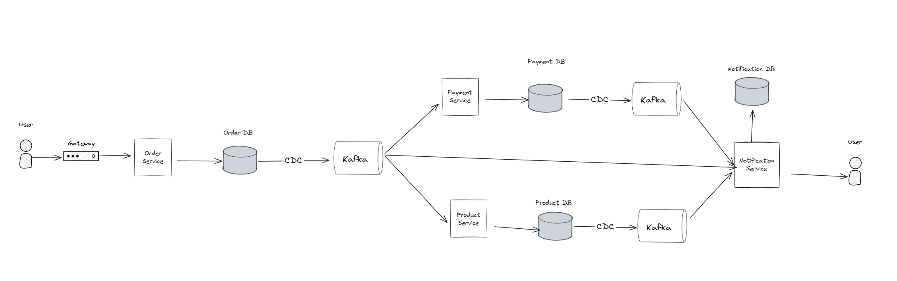

# 🚀 Distributed System - Saga Choreography with Outbox Pattern

[](https://www.docker.com/)
[](https://kafka.apache.org/)
[](https://spring.io/projects/spring-boot)
[](https://www.mysql.com/)

A microservices-based distributed system implementing the **Saga Choreography Pattern** with **Outbox Pattern** for reliable event-driven communication. Built with Spring Boot, Kafka, Debezium CDC, and MySQL.

---

## 📋 Table of Contents

- [System Architecture](#-system-architecture)
- [Services Overview](#-services-overview)
- [Prerequisites](#-prerequisites)
- [Quick Start](#-quick-start)
- [Running the System](#-running-the-system)
- [Service Endpoints](#-service-endpoints)
- [Kafka Topics & CDC](#-kafka-topics--cdc)
- [Troubleshooting](#-troubleshooting)
- [Project Structure](#-project-structure)

---

## 🏗 System Architecture



```
┌─────────────────────────────────────────────────────────────────┐
│                         API Gateway (8080)                       │
└───────────────────────────────┬─────────────────────────────────┘
                                │
                ┌───────────────┴───────────────┐
                │   Discovery Server (8761)      │
                │      (Eureka Server)           │
                └───────────────┬───────────────┘
                                │
        ┌───────────────────────┼───────────────────────┐
        │                       │                       │
┌───────▼────────┐    ┌────────▼─────────┐   ┌───────▼────────┐
│ Order Service  │    │ Payment Service  │   │Product Service │
│    (8081)      │    │     (8085)       │   │    (8084)      │
└───────┬────────┘    └────────┬─────────┘   └───────┬────────┘
        │                      │                      │
        └──────────────┬───────┴──────────┬──────────┘
                       │                  │
              ┌────────▼────────┐    ┌───▼──────────────┐
              │ Notification    │    │   MySQL (3306)   │
              │  Service (8082) │    │   - orderdb      │
              └────────┬────────┘    │   - paymentdb    │
                       │             │   - productdb    │
                       │             │   - notificationdb│
                       │             └──────────────────┘
                       │
            ┌──────────▼──────────┐
            │   Kafka (9092)      │
            │   + Kafka UI (9095) │
            └──────────┬──────────┘
                       │
            ┌──────────▼──────────┐
            │ Debezium Connect    │
            │      (8083)         │
            │   CDC Connectors    │
            └─────────────────────┘
```

---

## 🎯 Services Overview

### Infrastructure Services

| Service | Port | Description | Image |
|---------|------|-------------|-------|
| **MySQL Database** | 3306 | Shared MySQL instance with binlog enabled for CDC | `mysql:8.0` |
| **Kafka Broker** | 9092 (internal)<br>9094 (external) | Apache Kafka (KRaft mode, no Zookeeper) | `apache/kafka:3.9.1` |
| **Kafka UI** | 9095 | Web UI for Kafka visualization | `provectuslabs/kafka-ui:latest` |
| **Debezium Connect** | 8083 | Kafka Connect with Debezium for CDC | `debezium/connect:2.7.3.Final` |

### Application Services

| Service | Port | Description | Docker Image |
|---------|------|-------------|--------------|
| **Discovery Server** | 8761 | Eureka service registry | `hogiathang/distributed-eureka-server` |
| **API Gateway** | 8080 | Spring Cloud Gateway for routing | `hogiathang/distributed-gateway-service` |
| **Order Service** | 8081 | Manages orders with outbox pattern | Built from source |
| **Payment Service** | 8085 | Handles payment processing | Built from source |
| **Product Service** | 8084 | Manages product inventory | Built from source |
| **Notification Service** | 8082 | Sends notifications based on events | Built from source |

---

## 📦 Prerequisites

Before running the system, ensure you have:

- **Docker** & **Docker Compose** installed
- **Java 21** (for building services locally)
- **Maven 3.9+** (for building services locally)
- At least **8GB RAM** available for Docker
- **Ports available**: 3306, 8080-8084, 8761, 9092, 9094, 9095

---

## ⚡ Quick Start

### Option 1: Using Pre-built Docker Images (Recommended)

```powershell
# 1. Start infrastructure services
cd infra
docker-compose up -d

# 2. Wait for all services to be healthy (30-60 seconds)
docker-compose ps

# 3. Deploy Debezium CDC connectors
.\deploy-connectors.bat

# 4. Verify connectors are running
curl http://localhost:8083/connectors
```

### Option 2: Build and Run Services Locally

```powershell
# 1. Start infrastructure first
cd infra
docker-compose up -d

# 2. Build all services
cd ..\discovery-server
.\mvnw clean package -DskipTests

cd ..\gateway
.\mvnw clean package -DskipTests

cd ..\order-server
.\mvnw clean package -DskipTests

cd ..\payment-service
.\mvnw clean package -DskipTests

cd ..\product-service
.\mvnw clean package -DskipTests

cd ..\notification-service
.\mvnw clean package -DskipTests

# 3. Run services (in separate terminals)
# Terminal 1 - Discovery Server
cd discovery-server
.\mvnw spring-boot:run

# Terminal 2 - Order Service
cd order-server
.\mvnw spring-boot:run

# Terminal 3 - Payment Service
cd payment-service
.\mvnw spring-boot:run

# Terminal 4 - Product Service
cd product-service
.\mvnw spring-boot:run

# Terminal 5 - Notification Service
cd notification-service
.\mvnw spring-boot:run

# Terminal 6 - Gateway (start last)
cd gateway
.\mvnw spring-boot:run

# 4. Deploy CDC connectors
cd infra
.\deploy-connectors.bat
```

---

## 🎮 Running the System

### Step 1: Start Infrastructure

```powershell
cd infra
docker-compose up -d
```

This starts:
- MySQL with 4 databases (orderdb, paymentdb, productdb, notificationdb)
- Kafka broker (KRaft mode)
- Kafka UI
- Debezium Connect
- Discovery Server (Eureka)
- API Gateway

**Wait for services to be ready** (~30-60 seconds):

```powershell
# Check status
docker-compose ps

# Check logs
docker-compose logs -f
```

### Step 2: Verify MySQL Databases

```powershell
# Connect to MySQL
docker exec -it database mysql -uroot -proot

# Verify databases
SHOW DATABASES;
# Should show: orderdb, paymentdb, productdb, notificationdb
```

### Step 3: Deploy Debezium CDC Connectors

The connectors enable Change Data Capture (CDC) for the outbox pattern:

```powershell
# Windows
cd infra
.\deploy-connectors.bat

# Linux/Mac
cd infra
chmod +x deploy-connectors.sh
./deploy-connectors.sh
```

**Verify connectors:**

```powershell
# List all connectors
curl http://localhost:8083/connectors

# Check specific connector status
curl http://localhost:8083/connectors/order-connector-db2/status
curl http://localhost:8083/connectors/payment-connector-db2/status
curl http://localhost:8083/connectors/product-connector-db2/status
```

### Step 4: Start Application Services

If using Docker images, services are already running. If running locally:

**Start in this order:**

1. **Discovery Server** (Port 8761)
   ```powershell
   cd discovery-server
   .\mvnw spring-boot:run
   ```

2. Wait for Discovery Server to be ready, then start business services:

   **Order Service** (Port 8081)
   ```powershell
   cd order-server
   .\mvnw spring-boot:run
   ```

   **Payment Service** (Port 8085)
   ```powershell
   cd payment-service
   .\mvnw spring-boot:run
   ```

   **Product Service** (Port 8084)
   ```powershell
   cd product-service
   .\mvnw spring-boot:run
   ```

   **Notification Service** (Port 8082)
   ```powershell
   cd notification-service
   .\mvnw spring-boot:run
   ```

3. **Gateway** (Port 8080) - Start last after all services are registered
   ```powershell
   cd gateway
   .\mvnw spring-boot:run
   ```

### Step 5: Verify System is Running

**Check Eureka Dashboard:**
```
http://localhost:8761
```
All services should be registered.

**Check Kafka UI:**
```
http://localhost:9095
```
View topics and messages.

**Health Check:**
```powershell
# Via Gateway
curl http://localhost:8080/actuator/health

# Individual services
curl http://localhost:8081/actuator/health  # Order
curl http://localhost:8082/api/v1/notifications/health  # Notification
curl http://localhost:8085/actuator/health  # Payment
curl http://localhost:8084/actuator/health  # Product
```

---

## 🌐 Service Endpoints

### API Gateway (Port 8080)
All requests should go through the gateway:

```
http://localhost:8080/{service-name}/{endpoint}
```

### Order Service

| Method | Endpoint | Description |
|--------|----------|-------------|
| POST | `/api/v1/orders` | Create new order |
| GET | `/api/v1/orders` | Get all orders |
| GET | `/api/v1/orders/{id}` | Get order by ID |
| PUT | `/api/v1/orders/{id}` | Update order |
| DELETE | `/api/v1/orders/{id}` | Delete order |

**Example: Create Order**
```powershell
curl -X POST http://localhost:8080/order-service/api/v1/orders `
  -H "Content-Type: application/json" `
  -d '{
    "customerId": 1,
    "productId": 100,
    "quantity": 2,
    "totalAmount": 299.99
  }'
```

### Payment Service

| Method | Endpoint | Description |
|--------|----------|-------------|
| POST | `/api/v1/payments` | Process payment |
| GET | `/api/v1/payments` | Get all payments |
| GET | `/api/v1/payments/{id}` | Get payment by ID |
| GET | `/api/v1/payments/order/{orderId}` | Get payments by order ID |

**Example: Process Payment**
```powershell
curl -X POST http://localhost:8080/payment-service/api/v1/payments `
  -H "Content-Type: application/json" `
  -d '{
    "orderId": 1,
    "amount": 299.99,
    "paymentMethod": "CREDIT_CARD"
  }'
```

### Product Service

| Method | Endpoint | Description |
|--------|----------|-------------|
| GET | `/api/v1/products` | Get all products |
| GET | `/api/v1/products/{id}` | Get product by ID |
| POST | `/api/v1/products` | Create product |
| PUT | `/api/v1/products/{id}` | Update product |
| PUT | `/api/v1/products/{id}/stock` | Update stock |

**Example: Get Products**
```powershell
curl http://localhost:8080/product-service/api/v1/products
```

### Notification Service

| Method | Endpoint | Description |
|--------|----------|-------------|
| GET | `/api/v1/notifications` | Get all notifications |
| GET | `/api/v1/notifications/{id}` | Get notification by ID |
| GET | `/api/v1/notifications/order/{orderId}` | Get notifications by order |
| GET | `/api/v1/notifications/type/{type}` | Get by type (info/alert/warning/error) |
| POST | `/api/v1/notifications/create` | Create notification |

**Example: Get Notifications**
```powershell
curl http://localhost:8080/notification-service/api/v1/notifications
```

---

## 📡 Kafka Topics & CDC

### Debezium CDC Connectors

The system uses **Debezium** for Change Data Capture with the **Outbox Pattern**:

1. **Order Connector** (`order-connector-db2`)
   - Monitors: `orderdb.outbox` table
   - Topic prefix: `dbserver2`
   - Uses EventRouter transformation for outbox pattern

2. **Payment Connector** (`payment-connector-db2`)
   - Monitors: `paymentdb` database
   - Topic prefix: `dbserver2`
   - Uses ExtractNewRecordState transformation

3. **Product Connector** (`product-connector-db2`)
   - Monitors: `productdb` database
   - Topic prefix: `dbserver1`
   - Uses ExtractNewRecordState transformation

### Key Kafka Topics

- `dbserver2.orderdb.outbox` - Order events from outbox
- `dbserver2.paymentdb.*` - Payment events
- `dbserver1.productdb.*` - Product events
- `schema-changes.*` - Schema history topics

### Monitoring Kafka

**Kafka UI** (Recommended):
```
http://localhost:9095
```

**CLI Commands:**
```powershell
# List topics
docker exec -it broker kafka-topics.sh --bootstrap-server localhost:9092 --list

# Consume from topic
docker exec -it broker kafka-console-consumer.sh `
  --bootstrap-server localhost:9092 `
  --topic dbserver2.orderdb.outbox `
  --from-beginning

# Describe topic
docker exec -it broker kafka-topics.sh `
  --bootstrap-server localhost:9092 `
  --describe --topic dbserver2.orderdb.outbox
```

---

## 🔧 Troubleshooting

### Issue: Services can't connect to Discovery Server

**Solution:**
```powershell
# Check if Discovery Server is running
curl http://localhost:8761

# Check logs
docker logs registry

# Restart Discovery Server
docker-compose restart discovery-client
```

### Issue: Kafka Connect not ready

**Solution:**
```powershell
# Check Connect status
curl http://localhost:8083/

# Check logs
docker logs connect

# Restart Connect
docker-compose restart connect

# Wait 30 seconds before deploying connectors
```

### Issue: MySQL connection refused

**Solution:**
```powershell
# Check MySQL is running
docker ps | findstr database

# Check MySQL logs
docker logs database

# Verify databases exist
docker exec -it database mysql -uroot -proot -e "SHOW DATABASES;"

# Restart MySQL
docker-compose restart database
```

### Issue: Connectors failed to deploy

**Solution:**
```powershell
# Check connector status
curl http://localhost:8083/connectors/order-connector-db2/status

# Delete and recreate connector
curl -X DELETE http://localhost:8083/connectors/order-connector-db2

# Redeploy
cd infra
.\deploy-connectors.bat

# Check Connect logs
docker logs connect -f
```

### Issue: Gateway returns 503 Service Unavailable

**Solution:**
- Wait for all services to register with Eureka (~30 seconds)
- Check Eureka dashboard: http://localhost:8761
- Restart Gateway after all services are up

### Issue: Port already in use

**Solution:**
```powershell
# Find process using port (example: 8080)
netstat -ano | findstr :8080

# Kill process by PID
taskkill /PID <PID> /F

# Or change ports in docker-compose.yaml or application.yaml
```

### Viewing Logs

```powershell
# All services
docker-compose -f infra/docker-compose.yaml logs -f

# Specific service
docker logs -f broker
docker logs -f database
docker logs -f connect
docker logs -f registry
docker logs -f gateway

# Follow logs for multiple services
docker-compose -f infra/docker-compose.yaml logs -f kafka database connect
```

---

## 📁 Project Structure

```
a_HPT_Saga_Cho_outbox/
│
├── discovery-server/          # Eureka Server (Service Registry)
│   ├── docker/
│   │   └── Dockerfile
│   ├── src/
│   ├── pom.xml
│   └── README.md
│
├── gateway/                   # API Gateway (Spring Cloud Gateway)
│   ├── docker/
│   │   └── Dockerfile
│   ├── src/
│   ├── pom.xml
│   └── README.md
│
├── order-server/              # Order Service (Saga Orchestrator)
│   ├── docker/
│   │   ├── Dockerfile
│   │   └── docker-compose.yaml
│   ├── src/
│   ├── pom.xml
│   └── README.md
│
├── payment-service/           # Payment Service
│   ├── docker/
│   │   └── Dockerfile
│   ├── src/
│   ├── pom.xml
│   └── README.md
│
├── product-service/           # Product/Inventory Service
│   ├── docker/
│   │   ├── Dockerfile
│   │   └── docker-compose.yaml
│   ├── src/
│   └── pom.xml
│
├── notification-service/      # Notification Service
│   ├── docker/
│   │   ├── Dockerfile
│   │   └── docker-compose.yaml
│   ├── scripts/
│   │   └── init-db.sql
│   ├── src/
│   ├── pom.xml
│   └── README.md
│
├── infra/                     # Infrastructure Setup
│   ├── docker-compose.yaml    # Main infrastructure
│   ├── init.sql               # Database initialization
│   ├── deploy-connectors.bat  # Windows connector deployment
│   ├── deploy-connectors.sh   # Linux/Mac connector deployment
│   ├── kafka/
│   │   └── connectors/        # Debezium connector configs
│   │       ├── order-connector-db2.json
│   │       ├── payment-connector-db2.json
│   │       └── product-connector-db2.json
│   └── README.md
│
└── README.md                  # This file
```

---

## 🔒 Configuration

### Database Credentials

**MySQL:**
- Host: `localhost:3306`
- Root Password: `root`
- User: `db_user`
- Password: `Database@Password123`

### Kafka Configuration

**Bootstrap Servers:**
- Internal (from containers): `broker:9092`
- External (from host): `localhost:9094`

### Service Ports

| Service | Port |
|---------|------|
| MySQL | 3306 |
| Discovery Server | 8761 |
| Gateway | 8080 |
| Order Service | 8081 |
| Notification Service | 8082 |
| Debezium Connect | 8083 |
| Product Service | 8084 |
| Payment Service | 8085 |
| Kafka (external) | 9094 |
| Kafka UI | 9095 |

---

## 🛑 Stopping the System

### Stop all infrastructure:
```powershell
cd infra
docker-compose down
```

### Stop and remove volumes (clean state):
```powershell
cd infra
docker-compose down -v
```

### Stop specific service:
```powershell
docker-compose stop <service-name>
```

### Stop local Java services:
```
Ctrl+C in each terminal
```

---

## 🎓 Learning Resources

- **Saga Pattern**: https://microservices.io/patterns/data/saga.html
- **Outbox Pattern**: https://microservices.io/patterns/data/transactional-outbox.html
- **Debezium CDC**: https://debezium.io/
- **Spring Cloud**: https://spring.io/projects/spring-cloud
- **Apache Kafka**: https://kafka.apache.org/documentation/

---

## 📝 Notes

1. **Startup Order**: Discovery Server → Business Services → Gateway
2. **CDC Connectors**: Deploy after all infrastructure is running
3. **Binlog Format**: MySQL must have `binlog-format=ROW` for Debezium
4. **KRaft Mode**: Kafka runs without Zookeeper (KRaft mode)
5. **Docker Resources**: Ensure Docker has sufficient memory (8GB recommended)

---

## 🤝 Contributing

1. Fork the repository
2. Create your feature branch
3. Commit your changes
4. Push to the branch
5. Create a Pull Request

---

## 📄 License

This project is part of a distributed systems learning initiative.

---

**Happy Coding! 🚀**
"# Saga-Choreography-with-Outbox-Pattern" 
